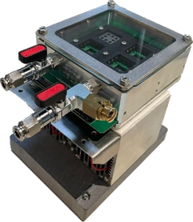

<figure markdown="span">
  { .on-glb width="80%"}
  <figcaption></figcaption>
</figure>
The Arkeo chamber M is a compact, detachable, climatic chamber. It features glass cover to seal any contained gas. An inlet and outlet is available for continous fluxing of gasses. The inlet contains an overpressure valve. The recommended pressure is 0.2 bar, with the overpressure valve activating at 0.5 bar. 
The full, single piece, aluminium body ensures a homogenious temperature distribution in the chamber. The chamber can be placed on a peltier controlled temperature stage, allowing temperatures between -5 degC and 85 degC. Fans ensure the heat sink of the peltier element is kept at ambient temperature for optimal peltier performance.
The chamber itself contains the standard 72x2 header pins, allowing up to 32 device channels (+ and -), 4 sensor channels and 5V power to arrive at any connected sample holder.
