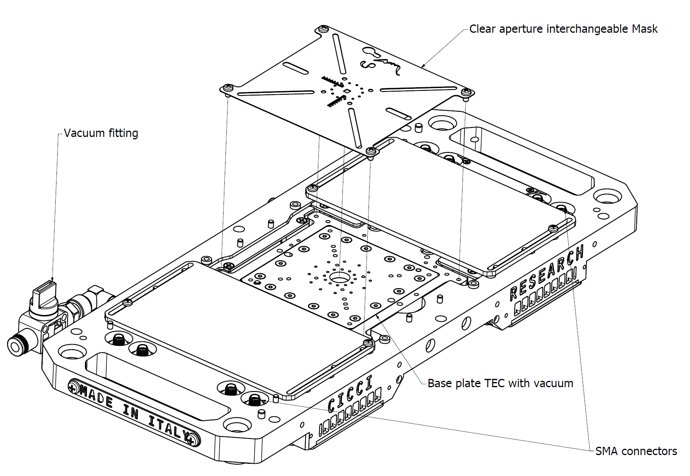
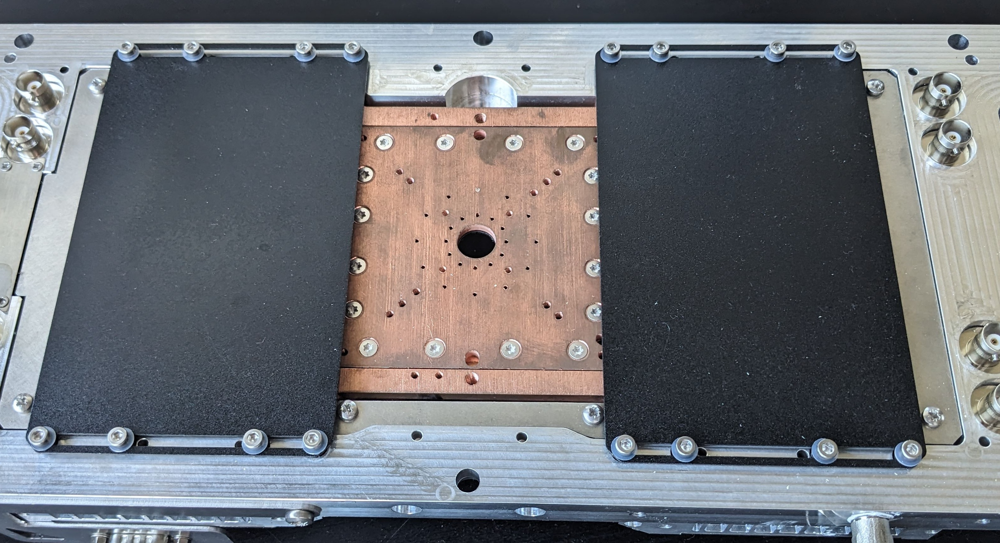
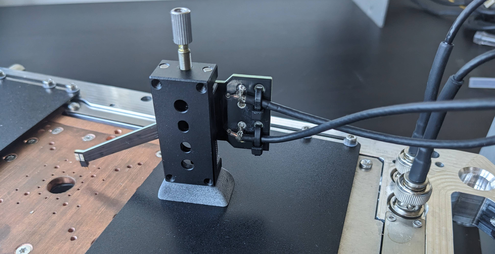
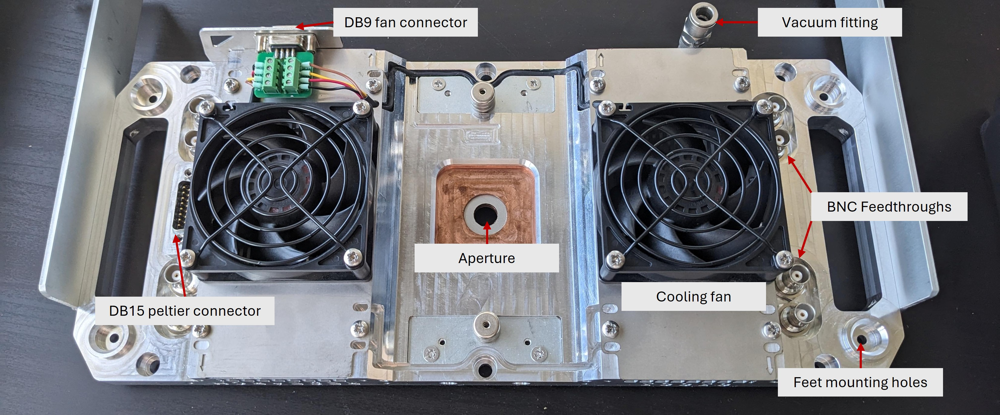
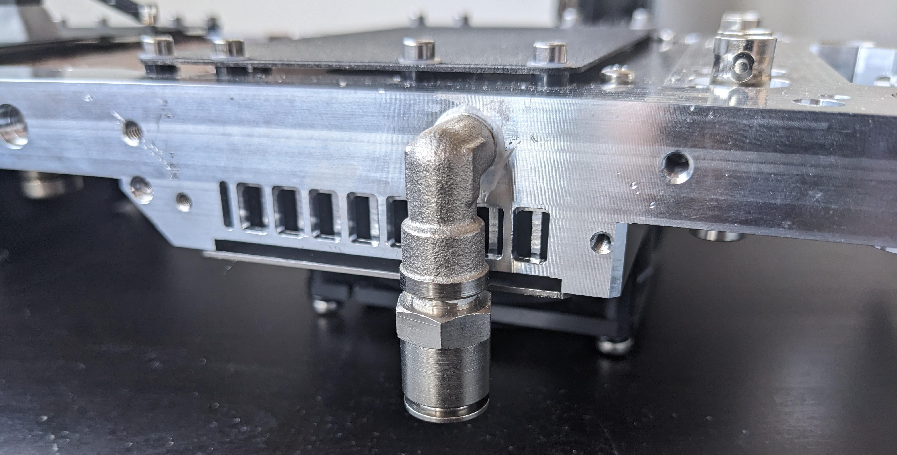

# Measurement Stage

<figure markdown="span">
  { .on-glb width="80%"}
  <figcaption></figcaption>
</figure>

## Overview

The ARKEO measurement stage is designed to provide a mechanically stable, electrically reliable, and optically accessible platform for device characterization. The stage enables electrical contacting, controlled illumination, luminescence collection, and thermal management within a compact and modular structure.

The modular design of the ARKEO measurement stage allows integration with multiple measurement routines, including JV, Dark JV, IPCE, Photoluminescence, and other optoelectronic  characterization techniques.

---

## Mechanical Integration

The stage can be:

-   Placed freely using adjustable legs
-   Fixed directly to the measurement system using brackets

When mounted using brackets, the overall system footprint is reduced, enabling a more compact laboratory setup while maintaining mechanical rigidity and alignment precision.

---

## Base Plate

<figure markdown="span">
  { .on-glb width="80%"}
  <figcaption></figcaption>
</figure>

At the core of the stage is a copper base plate on which the device under test (DUT) is placed. Copper is chosen for its high thermal conductivity, ensuring efficient heat spreading and stable temperature control when combined with the underlying TEC system.

The base plate includes:

-   A central optical aperture allowing illumination from the bottom
-   The possibility to collect luminescence signals using a photodetector (see Accessories section)
-   Precision screw holes for fixing interchangeable aperture masks

The interchangeable masks enable accurate control of the illuminated or measured active area, ensuring reproducible and well-defined measurement geometries.

---

## Electrical Contacting

<figure markdown="span">
  { .on-glb width="80%"}
  <figcaption></figcaption>
</figure>

Electrical probes are mounted magnetically on movable plates, allowing flexible positioning depending on device geometry. This magnetic coupling ensures mechanical stability during measurements

Feedthrough BNC connectors are integrated into the stage body, providing shielded and low-noise electrical connections between the device and external instrumentation. A removable cover can be placed over the stage to completely shield the device from ambient light. 

---

## Thermal Control System

<figure markdown="span">
  { .on-glb width="80%"}
  <figcaption></figcaption>
</figure>

The measurement stage integrates an active thermal control system based on two Peltier (thermoelectric) elements, enabling controlled operation over a temperature range from **−5 °C to 85 °C**. The dual-Peltier configuration improves thermal uniformity across the copper base plate and provides sufficient heating and cooling power for temperature-dependent measurements, stability studies, and transport investigations.

Efficient heat removal from the hot side of the Peltier elements is ensured by two integrated cooling fans mounted on dedicated heatsinks. Active airflow is essential to maintain temperature stability, achieve low temperatures, and preserve optimal thermoelectric performance across the full operating range.

The Peltier elements interface with the measurement system through a standard DB15 connector, while the cooling fans are connected via a DB9 connector. This standardized electrical integration allows reliable control, straightforward system interfacing, and modular servicing of the thermal components.

---

## Vacuum Fixation

<figure markdown="span">
  { .on-glb width="80%"}
  <figcaption></figcaption>
</figure>

A vacuum fitting is integrated into the stage to enable fixation of flexible or lightweight substrates directly onto the base plate. This is particularly useful for:

-   Thin-film devices
-   Flexible photovoltaic substrates
-   Lightweight samples prone to warping

The vacuum hold-down ensures flat and stable contact during measurement without introducing mechanical stress.

---
