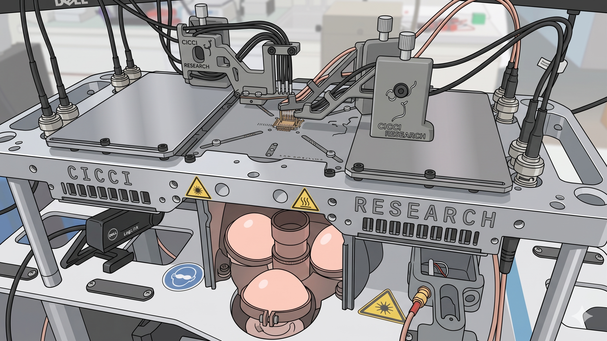
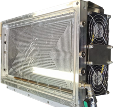
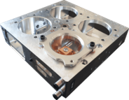

# Light Sources

Light Sources by Cicci Research provide controlled illumination systems for photovoltaic and optoelectronic device testing.

[Download Flyer :material-file-download:](../assets/files/Arkeo%20Environmental%20Chambers.pdf){ .md-button }

---

  

    
    <h3>Fixture</h3>
    
Advanced stage for all-in-one measurements. .

    <a href="fixture/" class="md-button">View Details</a>
  

  

    
    <h3>Chamber XXL</h3>
    
Large temperature and environment controlled chamber for aging measurements

    <a href="chamber-xxl/" class="md-button">View Details</a>
  

  

    
    <h3>Chamber M</h3>
    
Compact, detachable environmental chamber .

    <a href="chamber-m/" class="md-button">View Details</a>
  

  

    
    <h3>Chamber 4X</h3>
    
Small indiviually controlled environmental chambers

    <a href="chamber-4x/" class="md-button">View Details</a>
  

