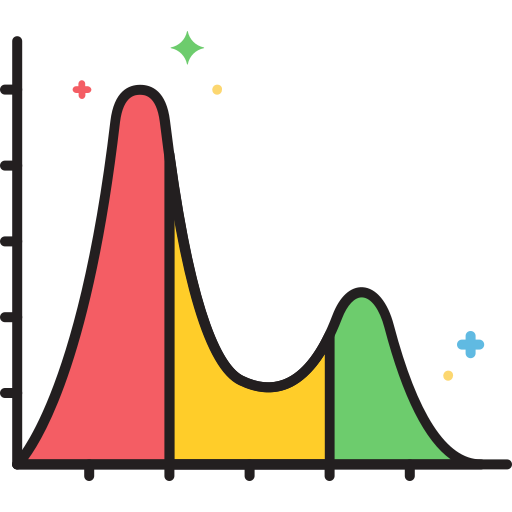
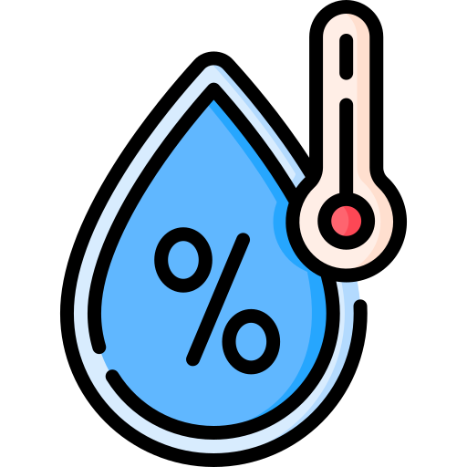
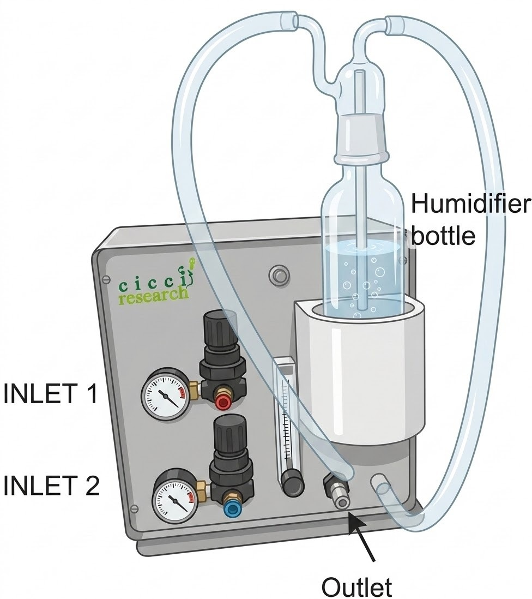

# Products

Explore Cicci Research instrumentation for photovoltaic and optoelectronic characterization.

---

  

    
    <h3>Light Sources</h3>
    
Controlled illumination systems for stability testing and spectral characterization.

    <a href="light-sources/" class="md-button">View Details</a>
  

  

    
    <h3>Environmental Chambers</h3>
    
Temperature-controlled environments for device testing and aging experiments.

    <a href="chambers/" class="md-button">View Details</a>
  

  

    
    <h3>Air Unit</h3>
    
Gas flow and environmental control systems for advanced testing setups.

    <a href="air-unit/" class="md-button">View Details</a>
  

