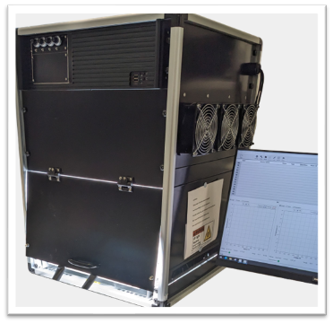
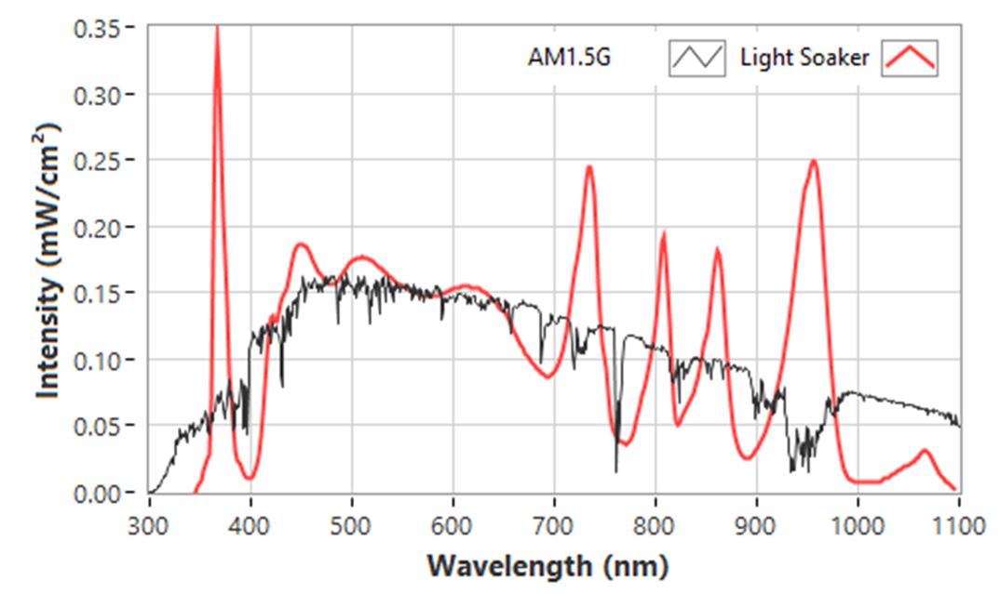
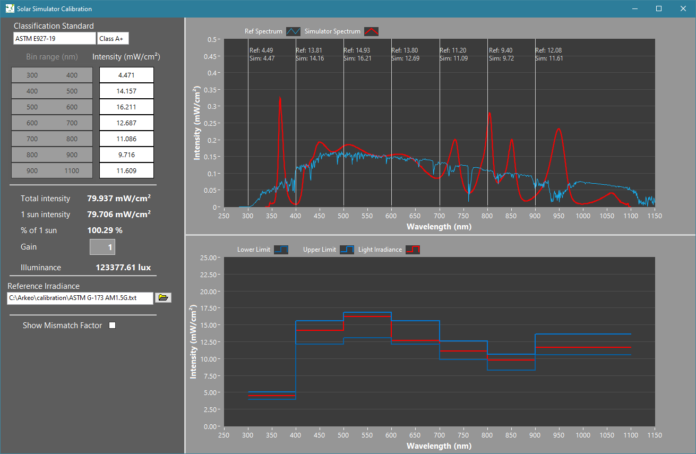
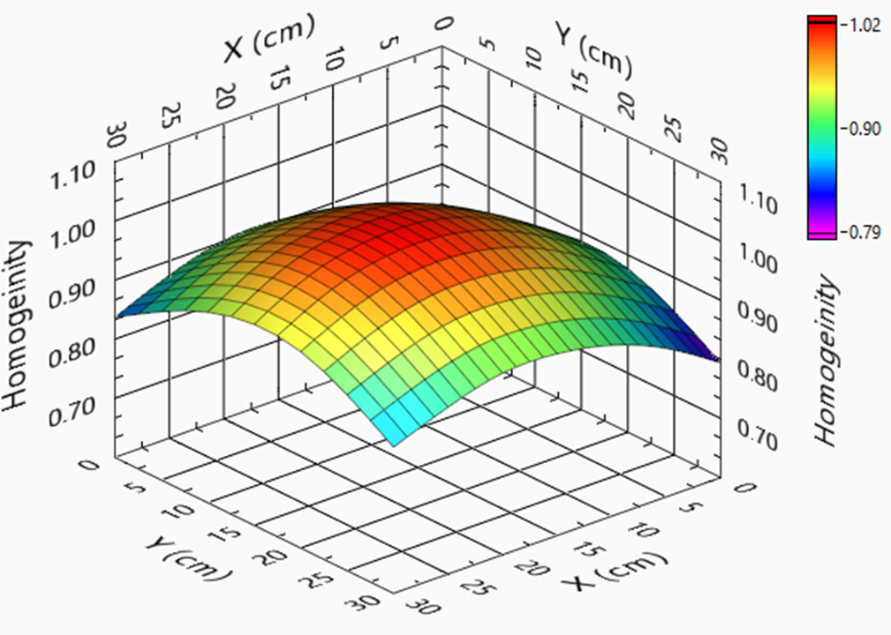

# Light Soaker

Light Soaker systems provide uniform, high-stability illumination for photovoltaic and optoelectronic device testing.

They are designed for long-term stability experiments, ISOS protocols, and controlled spectral studies. The system enables precise and reproducible illumination over large areas, making it ideal for both research and industrial environments.

[Download Product Flyer :material-file-download:](../assets/files/Arkeo%20Large%20area%20Light%20Soaker.pdf){ .md-button }

---

## Key Features

- Class A spectral match to AM1.5G
- High spatial homogeneity over large areas
- Long-term irradiance stability (< 2%)
- Multiple independently controlled LED lines
- Designed for continuous operation (aging / stability tests)

---

## System Overview

## Specifications

| Parameter        | Value               |
|------------------|---------------------|
| Dimensions       | 52.5 × 52.5 × 70 cm |
| Working Area     | 30 × 30 cm          |
| Max Power        | 1300 W              |
| Weight           | 50 kg               |
| LED Lines        | 4 independent       |

---

## Irradiance Performance

| Parameter             | Value                              |
|-----------------------|------------------------------------|
| Spectrum Range        | 350–1100 nm                        |
| Spectrum Class        | Class A (< ±15% of AM1.5G)         |
| Homogeneity Class     | Class A (10 cm radius)             |
|                       | Class B (18 cm radius)             |
| Stability Class       | Class A (< 2% after stabilization) |

---

## Available LED Configurations

| Line | Peak (nm)          |
|------|--------------------|
| UV   | 365 nm             |
| VIS  | Visible            |
| IR   | 730 + 850 + 940 nm |
| FIR  | 800 + 1050 nm      |

---

## Performance Visualization

- **Spectral Shape**  
  

- **Spectral Classification**  
  

- **Homogeneity Map**  
  

---

## Notes

For detailed calibration data, customization options, and system integration support, please contact Cicci Research.