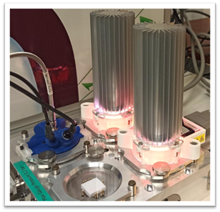
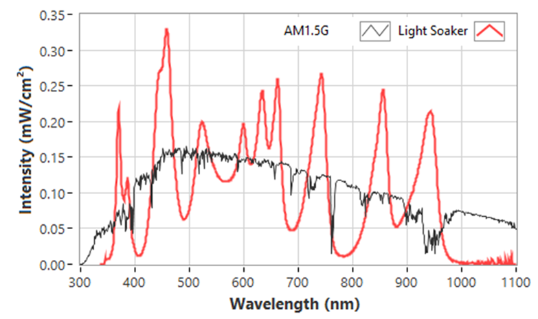
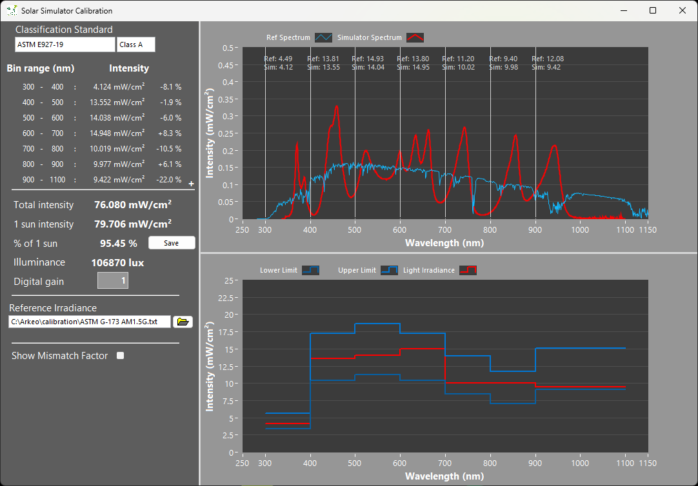

# MultiLED

MultiLED is a compact, multi-wavelength illumination system designed for flexible spectral control in photovoltaic and optoelectronic experiments.

It enables precise tuning of the illumination spectrum using multiple independently controlled LED channels, making it ideal for indoor photovoltaics, sensor calibration, and advanced research applications.

[Download Product Flyer :material-file-download:](../assets/files/Arkeo%20Multi%20LED.pdf){ .md-button }

---

## Key Features

- 12 independently controllable LED channels
- Wide spectral coverage from UV to infrared
- Compact and lightweight design
- Flexible spectral tuning for custom illumination profiles
- Suitable for integration and standalone use

---

## System Overview

## Specifications

| Parameter        | Value           |
|------------------|-----------------|
| Dimensions       | 6 × 6 × 14 cm   |
| Working Area     | 2 × 2 cm        |
| Max Power        | 20 W            |
| Weight           | 0.4 kg          |
| LED Lines        | 12 independent  |

---

## Irradiance Performance

| Parameter             | Value                              |
|-----------------------|------------------------------------|
| Spectrum Range        | 350–950 nm                         |
| Spectrum Class        | Class A (< ±15% of AM1.5G)         |
| Homogeneity Class     | Depends on setup                   |
| Stability Class       | Class A (< 2% after stabilization) |

---

## Available LED Configurations

| Line        | Peak (nm) |
|-------------|----------|
| Warm White  | Visible  |
| Cool White  | Visible  |
| Far UV      | 365 nm   |
| UV          | 385 nm   |
| Blue        | 455 nm   |
| Green       | 510 nm   |
| Amber       | 590 nm   |
| Red         | 625 nm   |
| Hyper Red   | 660 nm   |
| Far Red     | 730 nm   |
| IR          | 860 nm   |
| Far IR      | 940 nm   |

---

## Performance Visualization

- **Spectral Shape**  
  

- **Spectral Classification**  
  

---

## Notes

For detailed calibration data, customization options, and system integration support, please contact Cicci Research.